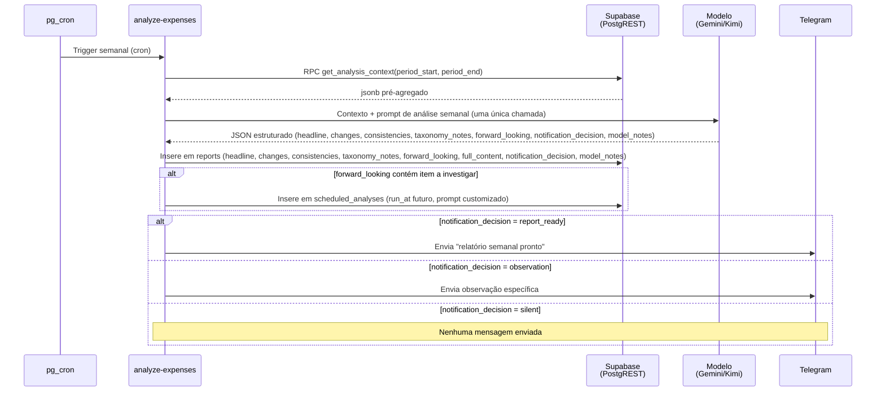
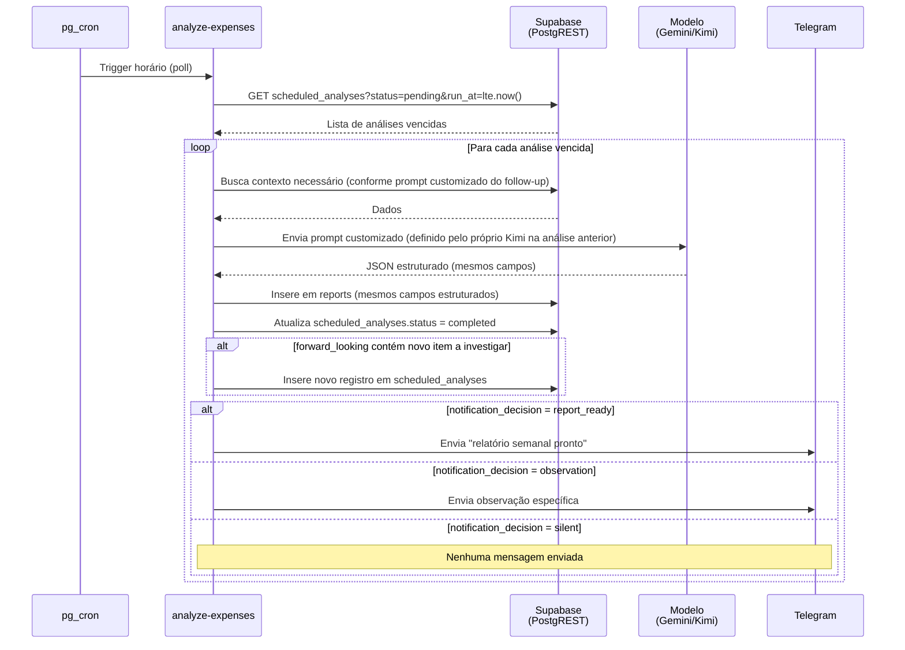

# Análise Semanal e Automações Agendadas

> **Status: implementado** em `supabase/functions/analyze-expenses/` — ver o
> [README da função](../supabase/functions/analyze-expenses/README.md) para configuração e testes.
> O texto abaixo descreve o desenho; o que mudou na implementação está anotado em cada ponto.
> A concepção original supunha um backend FastAPI com APScheduler (ver
> [`docs/api-endpoints-futuro.md`](api-endpoints-futuro.md)); a arquitetura atual usa uma Edge
> Function agendada por `pg_cron`, mantendo os mesmos princípios de design.

## Análise semanal

São dois jobs de `pg_cron`, um semanal (segundas, 12:00 UTC) e outro com polling horário sobre
`scheduled_analyses`, ambos chamando a mesma Edge Function `analyze-expenses` — o primeiro com
`{"mode":"weekly"}`, o segundo com `{"mode":"followups"}`. Internamente os dois convergem para a
mesma função `runAnalysis()`, o equivalente ao `run_analysis()` do desenho original.

O modelo nunca roda SQL — nem leitura livre, nem escrita. A RPC `get_analysis_context(period_start, period_end)` pré-agrega
os dados relevantes da semana (totais por categoria, comparação com a média móvel de 4 semanas,
top merchants, split por forma de pagamento, contagem de `pending_expenses` com `needs_detail`
acumulado) e tudo vai pronto no prompt, numa única chamada — sem loop de tool calling, mais barato
e sem superfície de validação de SQL para manter. O modelo responde só com JSON estruturado; é o
worker quem interpreta essa resposta e decide o que persistir — o modelo nunca tem uma tool de
escrita direta.

**Escolha de modelo**: o desenho original previa Kimi K2. Como Gemini e Kimi falam o mesmo
protocolo (OpenAI Chat Completions), o worker tem um só caminho de código e o provedor é
configuração (`ANALYSIS_PROVIDER`). O default é Gemini, porque a chave de free tier já roda o
`process-receipts` — custo zero e nenhum destino novo para dados financeiros, o que importa sob a
restrição de LGPD registrada no [`README`](../README.md). Kimi é opt-in e pago.

O relatório é armazenado em `reports` (migração
`20260930000001_create_reports_and_scheduled_analyses.sql`), com campos estruturados —
`headline`, `changes`, `consistencies`, `taxonomy_notes`, `forward_looking`, `full_content`,
`notification_decision` (enum `silent` / `report_ready` / `observation`), `model_notes`. Itens de
`forward_looking` que pedem acompanhamento futuro (`revisit_in_days`) viram novas linhas em
`scheduled_analyses`, processadas pelo job de polling horário.

> **Ainda não implementado**: a promoção automática de `taxonomy_notes` a linhas de `behavior_tags`
> (comportamental, proposto com frequência normal) ou de `categories` (venue, proposto raramente,
> já que venues devem ser estáveis). Hoje `taxonomy_notes` fica registrado no relatório e é lido
> por você; as tabelas `behavior_tags` e `expense_behavior_tags` continuam no
> [schema futuro](database-schema.md#schema-futuro-planejado).

Notificação via Telegram é decidida a cada execução pelo próprio `notification_decision` — não é
automática. Uma semana sem nada relevante fica `silent`; um relatório padrão pronto gera
`report_ready`; algo urgente o suficiente para não esperar gera `observation` imediata.

Categorias/tags em `status = 'candidate'` esperariam aprovação do usuário, como mensagem comum
no chat com o bot — sem endpoint novo. (Depende da promoção automática descrita acima, ainda não
implementada.)

Sob demanda, `/analisar` no bot dispara o modo `weekly` na hora e `/relatorio` lê o último
relatório salvo.

## Automações agendadas (follow-ups)

