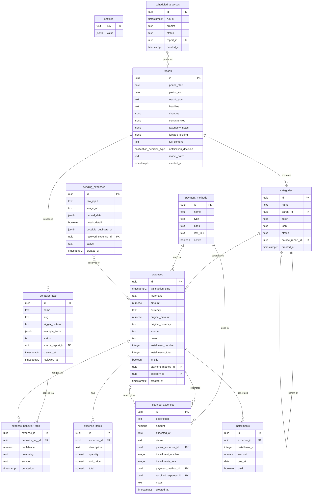

# Database Schema

Complete reference for Moneta's Supabase database schema.

## Core Tables

### `expenses`
Final expense records after AI processing or manual entry.

```sql
id (uuid) primary key
transaction_time (timestamptz) - when the expense occurred
merchant (text) - vendor/store name
amount (numeric) - expense amount
currency (text) - currency code (default "BRL")
category_id (uuid) FK → categories - expense category
payment_method_id (uuid) FK → payment_methods - how it was paid
source (text) - origin: 'ai_pipeline', 'user_manual', etc.
notes (text) - additional details
created_at (timestamptz) - insertion time
```

### `expense_items`
Line items within an expense (from receipt parsing).

```sql
id (uuid) primary key
expense_id (uuid) FK → expenses (ON DELETE CASCADE)
description (text) - item name/description
quantity (numeric) - amount purchased
unit_price (numeric) - price per unit
total (numeric) - subtotal for this item
```

### `pending_expenses`
Raw receipts awaiting AI processing or user confirmation.

```sql
id (uuid) primary key
raw_input (text) - user-provided text description (nullable)
image_url (text) - path in receipts bucket (nullable, compressed)
parsed_data (jsonb) - output from Gemini parsing
needs_detail (boolean) - AI flagged missing information
possible_duplicate_of (jsonb) - IDs of suspected duplicates
resolved_expense_id (uuid) FK → expenses - final expense if resolved
status (text) - 'pending', 'waiting_user', 'done', 'discarded', 'error'
telegram_chat_id (text) - user's Telegram ID
question_message_id (bigint) - last message ID in Telegram Q&A
attempts (integer) - retry count (reset on success, incremented on failure)
processed_at (timestamptz) - last processing timestamp (for budget tracking)
created_at (timestamptz)
```

### `payment_methods`
Registered payment methods (cards, accounts, etc.).

```sql
id (uuid) primary key
name (text) - display name (e.g., "NuBank Credit")
type (text) - 'credit_card', 'debit_card', 'cash', 'transfer', etc.
bank (text) - issuing bank (nullable)
last_four (text) - last 4 digits (nullable, for card display)
active (boolean) - soft-delete flag
```

### `categories`
Hierarchical expense categories.

```sql
id (uuid) primary key
name (text unique) - display name (e.g., "🏠 Housing")
slug (text unique) - URL-friendly ID (e.g., "housing")
description (text) - category explanation
parent_id (uuid) FK → categories - parent category (NULL for roots)
color (text) - Tailwind color class (e.g., "blue-500")
icon (text) - emoji or icon identifier
is_active (boolean) - soft-delete flag
sort_order (integer) - display order in UI
status (text) - 'candidate' (proposed by analysis), 'approved' or 'rejected'; defaults to
  'approved' so the 50 seeded categories are unaffected (migration 20260930000007)
source_report_id (uuid) FK → reports, on delete set null - the report that proposed this
  category, when status started as 'candidate'
created_at (timestamptz)
updated_at (timestamptz)
```

**Hierarchy Example:**
```
🏠 Housing (root)
  ├─ Rent / Mortgage
  ├─ Utilities
  ├─ Maintenance & Repairs
  └─ Property Tax
```

## Audit & Learning

### `audit_log`
Immutable log of all data changes (compliance + debugging).

```sql
id (uuid) primary key
action (text) - 'insert', 'update', 'delete', 'manual_review', 'reclassify', 'user_resolved', 'error_state'
table_name (text) - which table was affected (expenses, pending_expenses, etc.)
record_id (uuid) - the affected record's ID
old_values (jsonb) - before-state (for updates/deletes)
new_values (jsonb) - after-state (for inserts/updates)
changed_fields (text[]) - array of field names that changed
source (text) - 'ai_pipeline', 'user_manual', 'telegram_bot', 'api', 'admin_bulk'
user_id (uuid) - who triggered the change (NULL for automated)
error_message (text) - if the action failed or triggered manual review
metadata (jsonb) - context data (Gemini attempt #, confidence scores, etc.)
created_at (timestamptz) - immutable insertion time
```

### `user_feedback`
User corrections on AI-parsed data (used for model improvement).

```sql
id (uuid) primary key
pending_expense_id (uuid) FK → pending_expenses (ON DELETE CASCADE)
feedback_type (text) - 'duplicate_corrected', 'category_corrected', 'needs_detail_provided', 'rejected', 'manual_entry'
old_value (jsonb) - what AI predicted
corrected_value (jsonb) - what user provided
telegram_message_id (bigint) - context in Telegram conversation
telegram_chat_id (text) - user's Telegram ID
confidence_score (numeric) - AI's confidence in the prediction (0-1)
notes (text) - user's explanation for the correction
created_at (timestamptz)
resolved_at (timestamptz) - when feedback was actioned (NULL = pending)
linked_audit_log_id (uuid) FK → audit_log - when the feedback was applied
```

## Analysis & Reports

### `reports`
Reports produced by the scheduled analysis worker (`analyze-expenses`).

```sql
id (uuid) primary key
period_start (date) - first day of the analysed period
period_end (date) - last day of the analysed period
report_type (text) - 'weekly' (scheduled run) or 'followup' (scheduled_analyses item)
headline (text) - one-sentence summary of the period
changes (jsonb) - what moved against the 4-week baseline
consistencies (jsonb) - patterns that held
taxonomy_notes (jsonb) - array of {kind, name, rationale, trigger_pattern?, example_merchants?, parent_category?};
  kind is 'behavior_tag' or 'category'. Reports written before migration 20260930000007 store plain
  strings instead — parseAnalysis and the Relatórios screen read both forms. Each note is promoted by
  the worker to a candidate row in behavior_tags or categories (see below)
forward_looking (jsonb) - items to revisit; those with revisit_in_days become scheduled_analyses
full_content (text) - the full report in markdown
notification_decision (notification_decision_type) - 'silent', 'report_ready' or 'observation'
model_notes (text) - data limitations the model flagged
model_used (text) - provider/model that produced it
created_at (timestamptz)
```

A partial unique index on `(period_start, period_end) where report_type = 'weekly'` makes a
re-run of the same week an upsert instead of a duplicate.

### `scheduled_analyses`
Follow-ups a report scheduled for itself; polled hourly.

```sql
id (uuid) primary key
run_at (timestamptz) - when the follow-up becomes due
prompt (text) - the question the previous report wrote
status (text) - 'pending', 'completed', 'error', 'cancelled'
source_report_id (uuid) FK → reports - the report that requested it
report_id (uuid) FK → reports - the report it produced
error_message (text)
created_at (timestamptz)
```

### `behavior_tags`
Behavioral tags proposed by the weekly analysis (migration `20260930000007`).

```sql
id (uuid) primary key
name (text)
slug (text) unique
description (text)
trigger_pattern (text) - what makes an expense match this tag, per the analysis
example_items (jsonb) - merchant/item examples the analysis cited as evidence
status (text) - 'candidate', 'approved' or 'rejected'
source_report_id (uuid) FK → reports, on delete set null - the report that proposed it
created_at (timestamptz)
reviewed_at (timestamptz) - set by review_taxonomy_candidate()
```

### `expense_behavior_tags`
Which behavior tags apply to which expenses, and how confidently. Created alongside
`behavior_tags`, but nothing writes to it yet — see `docs/backlog.md`.

```sql
expense_id (uuid) FK → expenses, on delete cascade
behavior_tag_id (uuid) FK → behavior_tags, on delete cascade
confidence (numeric)
reasoning (text)
source (text)
created_at (timestamptz)
-- primary key (expense_id, behavior_tag_id)
```

## Analytics Views

Pre-built views for dashboards and monitoring:

### `expense_summary_by_category`
Spending by category & month.
```
category_id, category_name, month, expense_count, total_amount, avg_amount, first_expense, last_expense
```

### `pending_expenses_status_summary`
Queue health metrics.
```
status, count, earliest_record, latest_record, oldest_age_hours, newest_age_hours, avg_attempts
```

### `processing_performance_metrics`
AI pipeline effectiveness (last 30 days).
```
total_processed, successful_resolutions, success_rate_percent, error_count, awaiting_user, avg_attempts_per_record, max_attempts, needs_detail_count, duplicate_detections
```

### `payment_method_usage`
Payment method frequency & totals.
```
id, payment_method, payment_type, usage_count, total_amount, avg_amount, last_used, months_active
```

### `category_effectiveness`
Which categories AI classifies well vs. which need correction.
```
category_id, category_name, slug, auto_classified, manual_corrections, correction_rate_percent
```

### `duplicate_detection_log`
False positive/negative analysis (90 days).
```
date, duplicates_flagged, confirmed_duplicates, rejected_as_duplicate, discard_rate_percent
```

### `audit_summary`
Change tracking by source & type.
```
date, source, action, table_name, changes, unique_records, unique_users
```

## RPC Functions

### `resolve_pending_expense(uuid, jsonb, jsonb)`
Atomically insert expense + items and mark pending as done. (Existing)

```sql
p_pending_id: pending_expenses.id
p_expense: {merchant, transaction_time, amount, currency, notes}
p_items: [{description, quantity, unit_price, total}, ...]
returns: new expenses.id
```

### `create_manual_expense(...)`
Create expense from app UI.

```sql
p_transaction_time, p_merchant, p_amount, p_currency, p_category_id,
p_payment_method_id, p_items, p_notes, p_source
returns: new expenses.id
```

### `reclassify_expense(uuid, uuid, text, text)`
Change category & log change.

```sql
p_expense_id, p_new_category_id, p_notes, p_source
returns: void
```

### `resolve_pending_with_feedback(uuid, uuid, text, jsonb, text)`
Resolve pending with user corrections captured.

```sql
p_pending_id, p_category_id, p_merchant, p_corrected_fields, p_notes
returns: new expenses.id
```

### `bulk_update_pending_expenses(jsonb)`
Batch update multiple pending records.

```sql
p_updates: [{id, category_id, status, notes}, ...]
returns: table (updated_id, success, error_message)
```

### `suggest_category_for_merchant(text, numeric, jsonb, integer)`
AI-assisted category prediction (confidence scores).

```sql
p_merchant, p_amount, p_items, p_limit
returns: table (category_id, category_name, confidence)
```
**Priority order**: (1) user correction history (0.95), (2) amount matching (0.75), (3) merchant name regex (0.60)

### `get_top_categories_by_merchant(text, integer)`
Historical category lookup for a merchant.

```sql
p_merchant, p_limit
returns: table (category_id, category_name, usage_count, last_used)
```

### `get_analysis_context(date, date)`
Pre-aggregated period context for the analysis prompt. This is what keeps the language model out
of SQL: it receives the result of this call and nothing else.

```sql
p_period_start, p_period_end
returns: jsonb {period, totals, by_category, top_merchants, by_payment_method, queue}
```
Category totals are paired with a `prior_4w_weekly_avg` baseline (the four weeks before the
period, averaged per week) and the resulting `delta_vs_avg`.

### `log_audit(...)`
Insert audit log entry (for Edge Functions).

```sql
p_action, p_table_name, p_record_id, p_old_values, p_new_values,
p_changed_fields, p_source, p_user_id, p_error_message, p_metadata
returns: audit_log.id
```

### `review_taxonomy_candidate(text, uuid, text)`
Approve or reject a `behavior_tags`/`categories` candidate. The one write door for this flow — the
app has no insert/update policy on either table. SECURITY DEFINER; callable by `service_role`
(the Telegram bot) or by an `authenticated` caller on the `app_users` allowlist.

```sql
p_kind: 'behavior_tag' | 'category'
p_id: behavior_tags.id or categories.id
p_action: 'approved' | 'rejected'
returns: void -- updates status (+ reviewed_at for behavior_tag), logs to audit_log
```

## Indexes

**Performance optimization** — all tables have strategic indexes:

- `pending_expenses` — (status, created_at, processed_at, attempts)
- `expenses` — (transaction_time, category_id, payment_method_id)
- `audit_log` — (record_id + table_name, created_at, source, action)
- `user_feedback` — (pending_expense_id, feedback_type, resolved_at)
- `categories` — (parent_id, is_active, slug)

## Row-Level Security (RLS)

All tables have RLS enabled with **no policies** (restrictive by default):
- Access via `service_role` key only (Edge Functions)
- Future: add policies for app auth (users can read/write only their own data)

## Conventions

- **Timestamps**: always `timestamptz` (UTC, immutable)
- **UUIDs**: `gen_random_uuid()` for all IDs
- **Soft deletes**: use `is_active boolean` flag (don't actually delete)
- **Foreign keys**: always include `ON DELETE` strategy (CASCADE for items, SET NULL for categories)
- **JSONB**: for flexible schema (parsed data, metadata, feedback)
- **Text enums**: avoid hard constraints; validate in app layer

## Constraints

- `categories.parent_id != id` (prevent self-reference)
- `expenses.amount > 0` (positive amounts only)
- `pending_expenses.status` IN ('pending', 'waiting_user', 'done', 'discarded', 'error')
- `user_feedback.feedback_type` IN ('duplicate_corrected', 'category_corrected', ...)
- `audit_log.action` IN ('insert', 'update', 'delete', 'manual_review', 'reclassify', 'user_resolved', 'error_state')
- `behavior_tags.status` and `categories.status` IN ('candidate', 'approved', 'rejected')

## Schema Futuro (Planejado)

> Não migrado ainda. Extensões previstas pelo escopo original (parcelas, análise semanal) — ver
> [`docs/planejamento.md`](planejamento.md) e [`docs/automacoes-futuras.md`](automacoes-futuras.md).

- **`planned_expenses`** — gastos futuros previstos (parcelas, assinaturas), com `expected_at`, `installment_number`/`installments_total` e `resolved_expense_id` quando efetivado
- **`installments`** — parcelas individuais de uma `expense`, com `due_at` e `paid`
- **`settings`** — configurações chave/valor (ex.: orçamento por categoria)

> `reports` e `scheduled_analyses` saíram desta lista: foram migradas em
> `20260930000001` — ver [Analysis & Reports](#analysis--reports). `behavior_tags` e
> `expense_behavior_tags` saíram em `20260930000007` — ver a mesma seção.

Também previstas em `expenses` (ainda não migradas): `original_amount`/`original_currency` (para
gastos em moeda estrangeira), `installment_number`/`installments_total`, `is_gift`.


