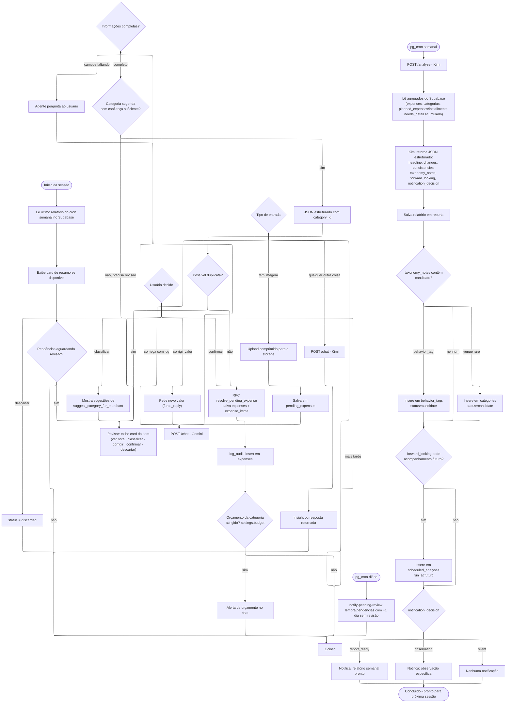

# Fluxo de Sessão do App (Planejado)

> **Status: planejado, mistura fluxo já implementado (Telegram, análise semanal) com features
> futuras** (app UI, orçamento por categoria). Serve como visão de ponta a ponta de como
> uma sessão do usuário deve se comportar quando essas peças existirem — ver
> [`docs/planejamento.md`](planejamento.md) para o que já está pronto hoje.

Notas:
- O ramo `/revisar` (E/G/CL/CV/DISC) já está implementado hoje via Telegram — ver
  [`docs/fluxos-interacao.md`](fluxos-interacao.md#fluxo-de-correção-revisar).
- Os ramos `POST /chat` e `POST /analyse` pressupõem o backend HTTP planejado — ver
  [`docs/api-endpoints-futuro.md`](api-endpoints-futuro.md).
- O ramo de orçamento por categoria (`R`/`S`) depende da tabela `settings`, ainda não migrada —
  ver [`docs/database-schema.md`](database-schema.md#schema-futuro-planejado).
- O ramo de análise semanal (`CRW` em diante) já está implementado como a Edge Function
  `analyze-expenses` — o nó `POST /analyse` corresponde hoje a uma chamada agendada por `pg_cron`,
  não a uma rota HTTP. Ver [`docs/automacoes-futuras.md`](automacoes-futuras.md).
- O ramo `WE`/`WF`/`WG` (promoção de `taxonomy_notes` a candidato) também já existe: o próprio
  worker insere o candidato logo depois de `WD`, sem passo humano nesse ponto. A aprovação é
  humana, mas vem depois e fora deste diagrama — via `/taxonomia` no Telegram ou a aba
  "Taxonomia" do app, ambos chamando `review_taxonomy_candidate()`. Ver
  [`docs/automacoes-futuras.md`](automacoes-futuras.md).
